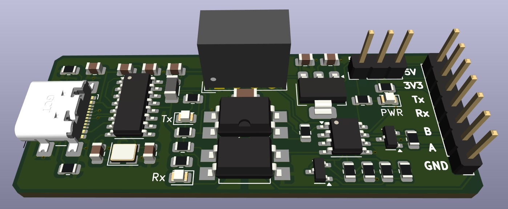
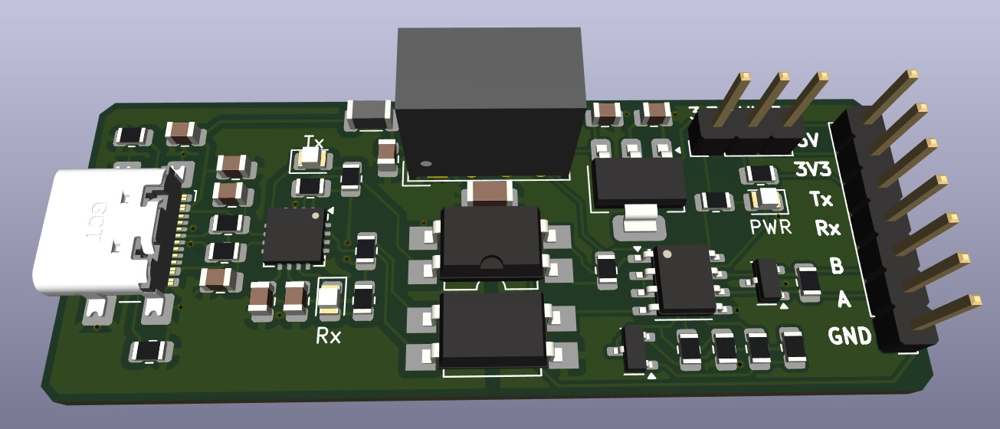

# ISO-RS485
## This is work in progress, not finished project (!)
USB to RS485 and UART converter with galvanic isolation.
This is one of tools for "everyday use" once you are in embedded.
Regardless variety of cheap USB-RS485 and USB-UART "whistles" on the market and on the web, they rarely meet our expectations.
This repo contains a simplistic converter I designed for my own use basing on my user experience.

## The main features:
- **USB-C connector.** Yes, whistles don't need USB cables but they are always near your USB port instead of being near your target hardware. So you always need long Rx/Tx/Gnd or A/B wires or some USB HUB on the desk. While it seems more natural to use generic USB-C cable which you can find everywhere currently (e.g. phone charger) and use some jumper cables etc. on serial side.
- **UART & RS485: both in one.** Yes, there are separate converters but I use both UART and RS485 quite frequently - so why not have them together in one device?
- **Galvanic isolation** "Safety first". Nobody likes burned hardware. Data lines are optically isolated. Power lines are isolated with transformer (isolated DC/DC). So the USB side and serial side are fully isolated.
- **Switchable levels.** UART levels can be choosen between 3.3 and 5V (with a jumper).
- **RS485 autodirection.** Additional transistor in this circuit makes RS485 transceiver switching between Transmit/Receive state automatically.
- **Indication:** 3 LEDs for Rx Tx and isolated power

## Versions
This repo contains 2 versions of hardware (in corresponding subfolders):
** - based on CH340G** IC. The part numbers in BOM of this version follow LCSC catalog.
Driver is available on [manufacturer's website](https://www.wch-ic.com/products/CH340.html).
- based on FTDI FT230 IC. The part numbers in BOM of this version follow Mouser catalog.
Driver is available on [manufacturer's website](https://ftdichip.com/drivers/).

## License
This project is licensed under:
- **Hardware (KiCad design files)**: Licensed under **CERN-OHL-W-2.0**, which allows modification and commercial use with attribution.

See the  for details. 
