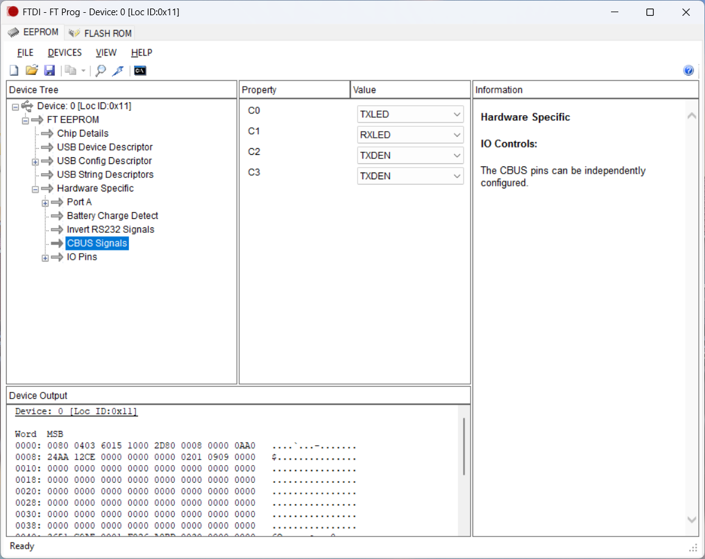

# ISO-RS485
## This version is tested and works ok.

USB to RS485 and UART converter with isolation.
This is one of tools for "everyday use" once you are in embedded.
Regardless variety of cheap USB-RS485 and USB-UART "whistles" on the market and on the web, they rarely meet our expectations. There are very cheap and quite limited converters and on the other side of spectrum there are good converters usually not affordable for individuals.
Surprisingly, after many years in electronics, I still don't have a completely satisfying USB-UART and USB-RS485 tools.
So this repo contains an iterative attempt to design a tool for my own use basing on my user experience.

## The main features:
- **USB-C connector.** Yes, whistles don't need USB cables but they are always near your USB port instead of being near your target hardware. So you always need long Rx/Tx/Gnd or A/B wires or some USB HUB on the desk. While it seems more natural to use generic USB-C cable which you can find everywhere currently (e.g. phone charger) and use some jumper cables etc. on serial side.
- **3 Mbaud UART** Stable UART communication on up to 3 Megabit per second with selectable voltage levels.
- **UART & RS485: both in one.** Yes, there are separate converters but I use both UART and RS485 quite frequently - so why not have them together in one device?
- **Isolation** "Safety first". Nobody likes burned hardware. UART lines are isolated with ADuM "digital isolator". Power lines are isolated with Traco isolated DC/DC. RS485 is connected via isolated transceiver So the USB side and serial side are fully isolated.
- **Switchable levels.** 3.3/5V is typical levels choice for USB-UART converters. Nevertheless, sometimes we work with projects where 1.8V UART levels are necessary and I faced lack of that feature. Thus the levels here can be chosen among 1.8, 3.3 and 5V (with a jumper).
- **RS485 autodirection.** In current version is handled by FT230.
- **Indication:** 3 LEDs for Rx Tx and isolated power

## Versions history
** Initially ** there were 2 similar designs in parallel: based on FT230 and CH340G.I used CH340 in several devices before and didn't face any issues with them (at least on low baud rates). Nevertheless, its availability is questionable and receiving parts from LCSC is often problematic, while I wanted the device to be reproduceable with one-stop order from big suppliers like Mouser or Digikey. Also I don't like CH340 drivers distribution as well as documentation. Its price makes it really attractive for DIY or projects where cost optimization is important but my personal feeling is the chip is immature for commercial projects or open source. So CH340 version was excluded from further development and is extinct by now.
Optical isolation was applied for data lines in that first version. And it was a wrong decision. I assembled one piece to have a look, the optocouplers expectedly limited the speed and I found the shape of signal completely dissatisfying. There was an option to use better optocouplers and correct the circuit but by that time I wanted to add 1.8V levels and to make signal looking better. So I decided to get rid of optical isolation shifting to isolated level shifter for UART.
** Current version** is being built around FT230, isolated RS485 transceiver, ADuM121 digital isolator for UART and multi-voltage isolated power supply for level shifting.

## Driver
FTDI FT230 driver is available on [manufacturer's website](https://ftdichip.com/drivers/).

## Assembly & Configuration
When using a new FT230 chip, default assignment of CBUS0...CBUS must be reconfigured first in MTP memory (as there is some mismatch between datasheet and actual values). For that purpose use [FT_PROG software from FTDI](https://ftdichip.com/utilities/): 
Devices -> Scan and Parse -> CBUS signals. Then assign CBUS according to schematics and program.

LDO is a bit hard to assembly without stencil, (any extra solder paste on EP pulls IC up breaking other connections), be attentive!

## Testing and Limitations
The device in the latest version was tested in UART mode (serial communication between 2 pieces) on all designed voltage levels (5V, 3.3V and 1.8V) with signals shape observation on baud rates up to 3 Mbps and results looked appropriate. 3 Mbps speed corresponds to limit declared by FTDI datasheet. 
In RS485 mode, the stability of transmission and signal "health" in our observation stayed appropriate up to 500 kbps, so there is some room for further improvement.

## ToDo
- replace AP7345D or modify footprint to prevent assembly issues;
- improve RS485 signal to increase its speed up to FT230 limit.

## License
This project is licensed under:
- **Hardware (KiCad design files)**: Licensed under **CERN-OHL-W-2.0**, which allows modification and commercial use with attribution.

See the  for details. 
